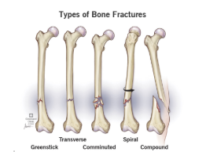
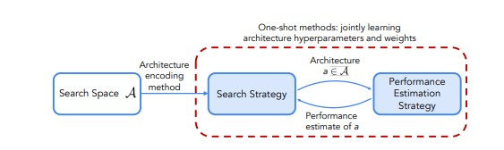
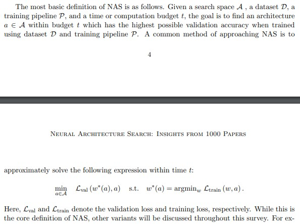
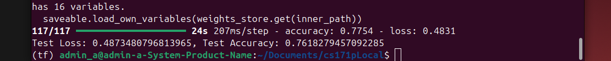
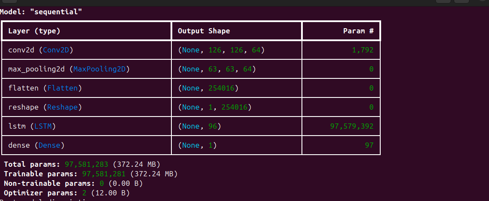
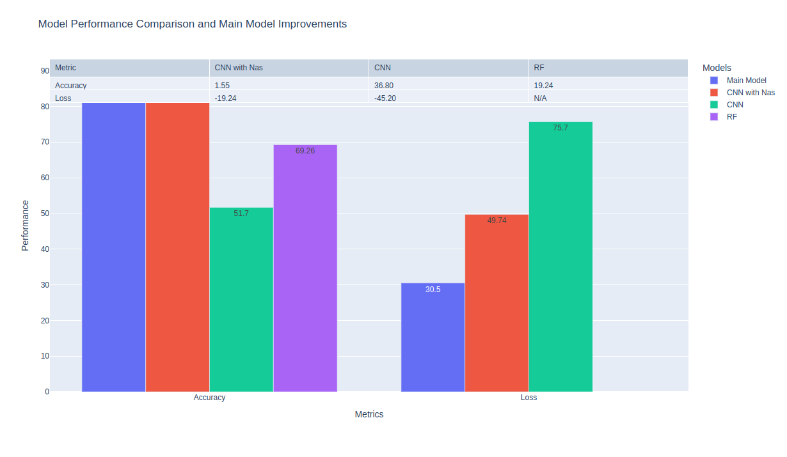

# Medical X-ray Image Classification


Author: Ashkan Nikfarjam

Collaborator: Vinhem Doung

# Abstract
Strong bones are the foundation of a healthy body. They protect our organs and help our muscles move. Therefore, it is crucial to maintain healthy bones.  There are 4 different types of bone fracture injuries; Greenstick, Transverse, Comminuted, Spiral and compound(Cleveland Clinic). Each has their own effect on human ability within athletes, adults and children.


# Introduction
To assist practitioners with correct diagnosis, a CNN-RNN model is used to classify the location of the provided X-Ray picture and determine whether or not it shows a fractured bone or a non fractured one. 

There are many approaches to this problem but Qiwei Yin and et al, suggested that CNN-RNN can over perform most of the other models by filtering out non-essential information and retaining critical features, such as edges and shapes and capturing the dependencies and continuity in these features. Thereby, enhancing the model's ability to analyze image sequences and improve classification accuracy.

# Data Sources

The data is collected from Kaggle and Robofile. The datasets used for this project consists of hands, forearms, knee, elbow, humerus, wrist, shoulders, legs, feet, hip, finger and vertebrae in the neck and back.

It was challenging to find an image dataset for all the bones, especially there were challenges with finding data that was appropriately labeled. Additionally most of the chest x-ray data set was only available for classification of respiratory diseases, because it helps with inspecting internal organs of this region (John Hopkins Medicine). The damages done due to bone fracture in this area is also so severe that they might need immediate medical attention. This problem also occurred with skull datasets that we found. 


# Data Preprocessing

This chart enhanced the understanding of data organization. As well as providing insight on how it has to be processed and redistributed. The majority of the dataset only contains train and test. Since there are enough pictures in some of the datasets it was decided to create validation datasets using 20% of training data.

Some datasets consisted of mixed body part x-ray pictures. For instance our hands, shoulders, and legs had only a little data. Therefore, after a total headcount, they are distributed and combined with other datasets of their relative same bone. The csv index file helped a lot in utilizing a  script to see the number of extracted data to plan accordingly and here is what was found.

```
        Total Fractured Hand X-Rays: 379
        Total Non Fractured Hand X-Rays: 902
        
        Total Fractured Hip X-Rays: 10
        Total Non Fractured Hip X-Rays: 169
        
        Total Fractured Shoulder X-Rays: 10
        Total Non Fractured Shoulder X-Rays: 91
        
        Total Fractured Leg X-Rays: 212
        Total Non Fractured Leg X-Rays: 1912
        

        # Hand & Other (Not Labeled Fractured or Non Fractured)
        
        Train Hand Files: 13140
        Train Other Files: 20224
        
        Test Hand Files: 1645
        Test Other Files: 2531
        
        Valid Hand Files: 1647
        Valid Other Files: 2530
        
        # Hand Part 2
       
        Train Frac Files: 711
        Train NonFrac Files: 596
       
        Test Frac Files: 225
        Test NonFrac Files: 256
       
        Valid Frac Files: 177
        Valid NonFrac Files: 148
        
        # Hands & Forearms
        
        Train Frac Files: 4391
        Train NonFrac Files: 4296
       
        Test Frac Files: 360
        Test NonFrac Files: 240
       
        Valid Frac Files: 89
        Valid NonFrac Files: 87
        
        # Legs
        
        Train Frac Files: 294
        Train NonFrac Files: 297
       
        Test Frac Files: 15
        Test NonFrac Files: 13
       
        Valid Frac Files: 28
        Valid NonFrac Files: 29
        
        # Legs&Feet
        
        Train Frac Files: 98
        Train NonFrac Files: 390
       
        Test Frac Files: 23
        Test NonFrac Files: 98
       
        Valid Frac Files: 7
        Valid NonFrac Files: 3
        
        # Shoulders
        
        Train Frac Files: 448
        Train NonFrac Files: 615
        
        Test Frac Files: 188
        Test NonFrac Files: 215
       
        Valid Frac Files: 112
        Valid NonFrac Files: 153

```

After these analyses, and combining them, data was evenly distributed in 60%, 20%, 20% respectively for Train, Test, Val datasets. 
### Ambiguous Datasets

he x-ray pictures of some body parts were resembling other body parts. The main concern was parts such as hand, wrist and forearm getting classified mistakenly into the same category. Similar to legs and feet. To prevent this a base model was created to label hand x-rays and another one for legs. The goal behind this was, if they all get classified as hand similarly classified as leg, they could get combined.


### Image Truncation

Another challenging part of data preprocessing was dealing with truncated images. It was concluded that data extracted from Robofile was augmented to generate a data set.  This augmentation truncated some of our data. A python script was created to verify truncation and repair truncated images by setting the values of the truncated part to zero.

```
eTrkImg.py 
Repairing legs and feet truncated images: 100%|█| 619/619 [00:00<00:00, 10523.
                                           file_path  truncated  repaired
0  newData/legsANDfeet/train/188_jpg.rf.7b0af0c70...      False     False
1  newData/legsANDfeet/train/119_jpg.rf.71666f3e0...      False     False
2  newData/legsANDfeet/train/95_jpg.rf.28ebcce69f...      False     False
3  newData/legsANDfeet/train/04_jpg.rf.7d15a19e51...      False     False
4  newData/legsANDfeet/train/130_jpg.rf.dbfd136d3...      False     False
truncated
False    619
Name: count, dtype: int64
repaired
False    619
Name: count, dtype: int64
CSV Data created for Legs & Feet
          None
          Number of Truncated Data: None
          Number of Repaired Data: None
          
Repairing hands and fingers truncated images: 100%|█| 9920/9920 [00:00<00:00, 
                                           file_path  truncated  repaired
0  newData/handsNfingers/train/2db5900558d0a70f24...      False     False
1  newData/handsNfingers/train/a952bdf7d90d82ce7a...      False     False
2  newData/handsNfingers/train/Screenshot-2022-07...      False     False
3  newData/handsNfingers/train/image-17-_jpeg_jpg...      False     False
4  newData/handsNfingers/train/390839a10f1484837c...      False     False
truncated
False    9920
Name: count, dtype: int64
repaired
False    9920
Name: count, dtype: int64
CSV Data created for Hands & Fingers
          None,
          
          Number of Truncated Images: None
          Number of Repaired Images: None
          
Repairing hands and forearms truncated images: 0it [00:00, ?it/s]
Empty DataFrame
Columns: [file_path, truncated, repaired]
Index: []
Series([], Name: count, dtype: int64)
Series([], Name: count, dtype: int64)
CSV Data created for Neck and Spine
          None,
          
          Number of Truncated Images: None
          Number of Repaired Images: None
          
Reparing neck and spine truncated images: 100%|█| 1001/1001 [00:00<00:00, 1089
                                           file_path  truncated  repaired
0  newData/NeckSpine/train/fracture/47f7292e24689...      False     False
1  newData/NeckSpine/train/fracture/ac5e26296afa0...      False     False
2  newData/NeckSpine/train/fracture/8523b6e75393d...      False     False
3  newData/NeckSpine/train/fracture/a52cefa39878f...      False     False
4  newData/NeckSpine/train/fracture/cf1a195d74090...      False     False
truncated
False    1001
Name: count, dtype: int64
repaired
False    1001
Name: count, dtype: int64
CSV Data created for Neck and Spine
          None,
          
          Number of Truncated Images: None
          Number of Repaired Images: None
          
```


### Steps of making base model for hand classification
* Data Augmentation: 

For the hand base model a data set consisting of hand and other pictures was used. Utilizing Keras image generator and applying rescale for normalization of pixel values and applying rotations and applying the Fast Fourier Transformation was applied for more accurate classification. 

``` Python
data_gen = ImageDataGenerator(
        rescale=1.0 / 255,  # Normalize pixel values
        rotation_range=90,  # Augmentation
        preprocessing_function=img_fft  # Apply our custom FFT preprocessing
    )
```

Our research proposes to use Fourier Transformation on these images.  Fourier Transformation is an algorithm where it allows us to transform images into a matrix of frequencies. Low frequencies represent gradual variations in the image; that contain the most information because they determine the overall shape or pattern in the image. High frequencies correspond to abrupt variations in the image; they provide more detail in the image, but they contain more noise (NV5). Since traditional Fourier Transform methods struggle with sudden or non-stationary signals, the authors suggest using a wavelet transform within the Fourier domain. This approach captures both local and global image characteristics, allowing the CNN-RNN model to extract valuable features from both the frequency and time domains of the image data (Qiwei Yin and et al). 

And this is the section we apply transformation:

``` Python
# Preprocessing function for Fourier Transform
    def img_fft(image):
        # Resize to target dimensions
        image = tf.image.resize(image, (128, 128))

        # Apply FFT
        fft_image = tf.signal.fft2d(tf.cast(image, tf.complex64))  # FFT returns complex numbers
        fft_image = tf.abs(fft_image)  # Use the magnitude

        # Normalize the FFT output
        fft_image = tf.math.log(1 + fft_image)  # Log scaling for visualization

        # Ensure we have 3 channels
        if len(fft_image.shape) < 3 or fft_image.shape[-1] != 3:
            fft_image = tf.stack([fft_image] * 3, axis=-1)

        return fft_image
```

The reduction in the size was necessary, otherwise the Fourier Transformation makes the process computationally expensive. We were getting running out of resources error.

* Create Test/Train/Validation dataset: 

Creation of  test, train and validation datasets for hand base model, was done using ImageDataGenerator's flow_fron_directory() method, which creates a numpy array of data, containing the frequency information, and its relative label.
 

```Python
# Ensure `target_size` matches your FFT resizing (128x128)
    train_data = data_gen.flow_from_directory(
        './Data/Data/Hand/train',
        target_size=(128, 128),  # Matches resizing in `img_fft`
        color_mode='rgb',       # Ensures 3 channels are expected
        class_mode='binary',
        batch_size=batch_size
    )
    validation_data = data_gen.flow_from_directory(
        './Data/Data/Hand/val',
        target_size=(128, 128),
        color_mode='rgb',
        class_mode='binary',
        batch_size=batch_size
    )
    test_data = data_gen.flow_from_directory(
        './Data/Data/Hand/test',
        target_size=(128, 128),
        color_mode='rgb',
        class_mode='binary',
        batch_size=batch_size
    )

```


Research shows strong performance of CNN-RNN model. However the complexity of these models arises during hyper parameter tuning. It is essential to use an appropriate architecture of neural network. In our case would be appropriate number of convolution, max pooling layers for CNN, and appropriate number of LSTM and number of layers in RNN. To come up with an optimal network structure NAS is utilized to help us to find optimal network architecture with optimal parameters.

# Network Architecture Search

NAS is a subfield of automated machine learning that automates all steps in the machine learning pipeline, from data cleaning, to feature engineering and selection, to hyperparameter optimization and architecture search. 



To mitigate hyperparameter optimization (HPO) problems, NAS uses a search space, a search strategy and a performance estimation strategy to peak the best model architecture.

A search space is a set of all architectures that NAS can select. A search strategy is a technique that is used to find the optimal strategy in the search space. A performance estimation strategy is a strategy where we try to predict the performance of the neural architecture.

NAS also trains the model, but with a unique twist: while a typical training process only adjusts the weights of a fixed network architecture, NAS actively trains both the model weights and the network architecture itself, searching for the optimal structure within a defined search space to achieve the best performance on a given task. 
**Mathematically**



## Result of Base Model for Hand

The hand base model NAS, trained a CNN-RNN model that has test accuracy of 76.18% and loss of 48.7%. 



And these is the architecture of the hand base model



### Labeling Hands and Forearm Images

Since we forgot to explicitly declare the model class indices, we wrote a script to return class labels definition. This script will label which is hand or forearm.


```Python
from tensorflow.keras.preprocessing.image import ImageDataGenerator

# Define the same data generator as in the main script
data_gen = ImageDataGenerator(
    rescale=1.0 / 255,
    rotation_range=90,
    preprocessing_function=None  # No preprocessing needed for this task
)

# Path to the training directory
train_data_path = './Data/Data/Hand/train'

# Load the data and map the labels
train_data = data_gen.flow_from_directory(
    train_data_path,
    target_size=(128, 128),
    color_mode='rgb',
    class_mode='binary',
    batch_size=32,
    shuffle=False  # Disable shuffle to match labels with directory names
)

# Extract the class indices
class_indices = train_data.class_indices

# Reverse the dictionary to map 0 and 1 to class names
label_mapping = {v: k for k, v in class_indices.items()}

print("Label Definitions:")
for label, class_name in label_mapping.items():
    print(f"{label}: {class_name}")

```
```
Label Definitions:
0: hand
1: other

```

After running our hand base model on the hand and forearm data, it seems like they are all predicted to be hands! This means we are going to label all the pictures in this folder as hands and combine it with the existing hands data set.

```
$ python hand_FA_labels\ _summer.py 
 
       HF Frac Test Predicted Label: predicted_label
0    360
Name: count, dtype: int64
       

      HF Frac Train Predicted Label: predicted_label
0    4391
Name: count, dtype: int64
       

      HF Frac Valid Predicted Label: predicted_label
0    89
Name: count, dtype: int64
      
 
       HF NFrac Test Predicted Label: predicted_label
0    240
Name: count, dtype: int64
       

      HF NFrac Train Predicted Label: predicted_label
0    4296
Name: count, dtype: int64
       

      HF NFrac Valid Predicted Label: predicted_label
0    240
Name: count, dtype: int64
      

```

Running this script against the wrist dataset gave us the same result meaning the hand dataset shall be a mix of hands, wrist and forearms. The legs base model did a similar approach for feet. Therefore, legs and feet datasets were combined to the same category.


# Main Model
Yin's paper, proposes CNN, and a Bidirectional LSTM RNN model. 
### Convolutional Layers
* Convolutional layers exatract important features from the raw data. Since we are deploying wavelet tranformation it does a greate job in detecting edges and shapes. 

* By applying multiple level of filtering, and max pooling layers, progressively combine lower-level features (edges, textures) into higher-level representations (objects, concepts). As well as dimentionality reduction.

### Why Wavelet Transfor
* Wavelet Transform provides both time and frequency information, making it ideal for analyzing signals or images where localized features (e.g., edges or patterns) are important.
* It is better suited for non-stationary signals (signals whose frequency characteristics change over time or space), such as fractured bones in medical imaging

### RNN
* Standard RNNs process data sequentially in one direction (e.g., from start to end). While useful, this approach limits the ability to understand dependencies that occur later in the sequence.

* Bidirectional RNNs add a second layer that processes the sequence in the opposite direction, enabling the model to use both previous and future context at every point in the sequence.


1. Forward pass:

   $$
   S_{i,j}^F = f_{\text{FWD}}(S_{i-1,j}^F, x_{i,j}), \quad \text{for } i = 1, \ldots, N
   $$

2. Backward pass:

  $$
    S_{i,j}^B = f_{\text{REV}}(S_{i+1,j}^B, x_{i,j}), \quad \text{for } i = N, \ldots, 1
  $$

## Stages of setting NAS for our Base Model
 
## Preprocessing:
* Apply wavelet Transform
* Normalyze Amplitude Matricies
* Check and repaire truncated data

# Search Space
* added convolution 2D layer
* added biodirectional RNN with LSTM component
* added a softmax layer at the end

# Nas parameter
* loss='sparse_categorical_crossentropy': is a commonly used loss function in machine learning, particularly for multi-class classification problems where target labels are integers rather than one-hot encoded.

# Search Strategy 
* Validation Score


Our Main Model Nas Trained a model with accuracy %88.5. With the following structure:


# performance of main model


Based upon the graphs, the main model did a pretty good job for classifying all body parts except for knees and spines Researches shows that this could happen because of Class Imbalance number of samples, which in our further investigation showed we had significantly unbalanced number of picture for these region compared to others. Poorly defined features was another reason showing up during research, in our implementation we used wavelet transformation that was improving the performance of the model. Noisy labels, which was possibly the main cause. We noticed we made a mistake in mapping our labels. As the code snippet shows we missed [0,6] and [1,6]. So a future improvement is fixing these labels and try to retrain our model with an even number of samples again and analyze the new performance matrices.

```
# Define custom labels
labels = {
    'hands/fractured': [1, 0],
    'hands/non-fractured': [0, 0],
    'elbow/fractured': [1, 1],
    'elbow/non-fractured': [0, 1],
    'humerus/fractured': [1, 2],
    'humerus/non-fractured': [0, 2],
    'shoulders/fractured': [1, 3],
    'shoulders/non-fractured': [0, 3],
    'legs/fractured': [1, 4],
    'legs/non-fractured': [0, 4],
    'hip/fractured': [1, 5],
    'hip/non-fractured': [0, 5],
    'knee/fractured': [1, 7],
    'knee/non-fractured': [0, 7],
    'spine/fractured': [1, 8],
    'spine/non-fractured': [0, 8],
    'forearm/fractured': [1, 9],
    'forearm/non-fractured': [0, 9]
}

```

# Main Model 
[Click to watch on YouTube](https://youtu.be/7yxMjqB8peY)


# Comparing Performance of out Main model with 2 other models

### CNN with NAS and hyperparameter tuning Result


We trained a traditional CNN model with a feed forward network. We were curious how much using NAS can affect the performance, since we were learning about advantages of combining CNN and RNN. The nas search space was looking for the optimal number of Conv2D layer, Max Pooling layer, Batch normalization, Flatten layer, dense layer, and dropout layers.  During the implementation of this model However, only a random 10% samples were used  due to the huge amount of data that was obtained during data collection. We noticed that it received a much better test accuracy of 87% percent.  It is almost as good as our main model.

### Traditional CNN


This is a traditional CNN built to compare itself with the main model but without using NAS. The CNN consists of Conv2D, BatchNormalization, Flatten, Dropout, MaxPooling and Dense layers. The Dense layer at the end has a value of 1 and an activation function of sigmoid. Thereby, showcasing that it's a CNN for binary classification.

Unfortunately, this CNN ran on a large and diverse dataset and it only received an accuracy of 51.73 percent. Therefore, this CNN was an inferior model and demonstrated that a traditional path is not the way forward.


### Random Forest Hyperparameter Testing Result


We ran a RandomSearchCV with a random forest classifier as our model. Our data was 10% of the main data we had, as our main data was too large for the RandomSearchCV. We chose a random forest classifier as it pairs well with RandomSearchCV. Random Forest can handle diverse data. Random Forest is also less susceptible to overfitting. Therefore, it seemed like a perfect fit for our large and diverse data.

Before we ran our model, we had to process the data. We had to keep track of the labels, which ones were fractured and non fractured. We also had to transform our images into integer arrays and resize them. After that, we split the data into 80% training and 20% test. We also created a validation set based around the 20% of the training set.
After that, we decided to input our values and set our parameters.  RandomForestClassifier was chosen for the reasons mentioned above. We also decided to choose RandomSearchCV as it was quicker than hyperparameter testing apps. Despite the fact that our dataset was only 10% of the original dataset. We still had to lower our parameters into the basic level. For example, the number of iterations we had to make was 10 and the number of folds for cross-validation was 3.

After running the model we were surprised by how accurate it was. It granted us a best score of 69% whilst, it granted us a test score of 77%, in contrast to the previous basic random forest classifier we had it was only around 64%. Therefore, we can ascertain that the Random Forest randomSearchCV model is efficient and possibly better than the CNN. However, it is not as good as our main model.

# Performance comparison


Using plotly we graph these models' performance to compare them to each other. It is evident that the CNN model that we train with keras tuner is almost as good as our main model on accuracy. However, the loss score was much worse. Thanks to the RNN component that made the prediction more accurate. The graph above shows the accuracy and loss improvement of our base model compared to the other ones. 


# Project files structure and their functionalities:
* CNNTunerColabRandom.py: CNN with NAS
* Data Preprocessing: Contains all the scripts that redistributed the datasets
* TraditionalCNNP2.py: Traditional CNN
* crossForest.py: Random Forest Model with randomSearchCv
* mainmodel.py: Trained and tested our main CNN-RNN model using keras tuner.
*  Class_identifier.py: this script identifies the binary base models description.
* handBaseModel.py: trains the base CNN-RNN model for labeling hand x-ray pictures.
*  hand_FA_labels_semmery.py: a python script that makes a csv files of our hands and forearm labeling process.
*  Hand_base_cnnrnn_desc.py: a python script to display layers of our hand base model.
*  Label_fingers.py: script that labels fingers pictures using the hand's base model.
* Label_hands.py: script that labels hands and forearm data set.
* legsBaseModel.py: trains the base model for labeling leg and feed data set.
* Main_model_desc.py: displays the layers of the best main CNN-RNN model.
* mainModelVisuals.py:script that uses plotly to graph the performance comparison of all four models we used.
* Wrist_lable.py: Labels wrist data set using hand’s base model.


# Check for GPUs
```python
gpus = tf.config.list_physical_devices('GPU')
if gpus:
    try:
        for gpu in gpus:
            tf.config.experimental.set_memory_growth(gpu, True)
        print(f"GPUs found: {gpus}")
    except RuntimeError as e:
        print(e)
else:
    print("No GPU detected")
```

