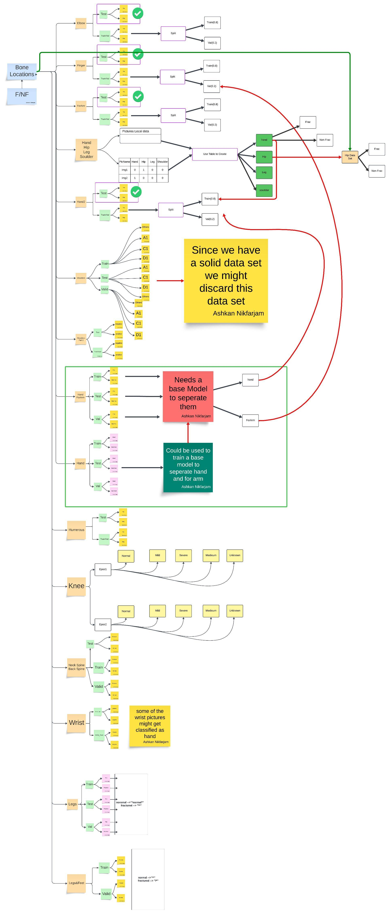
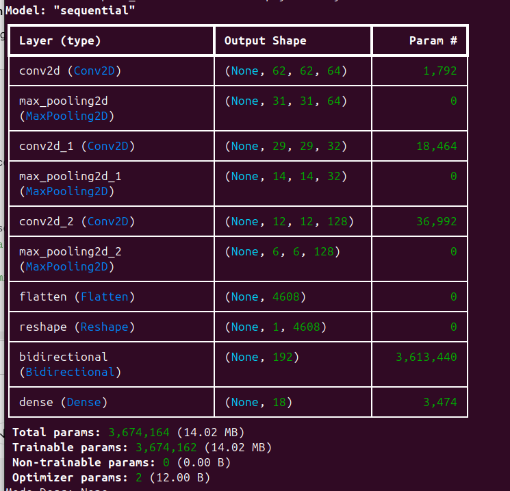
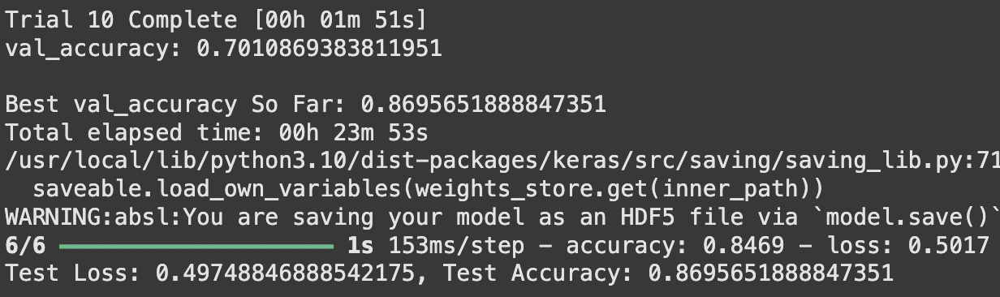
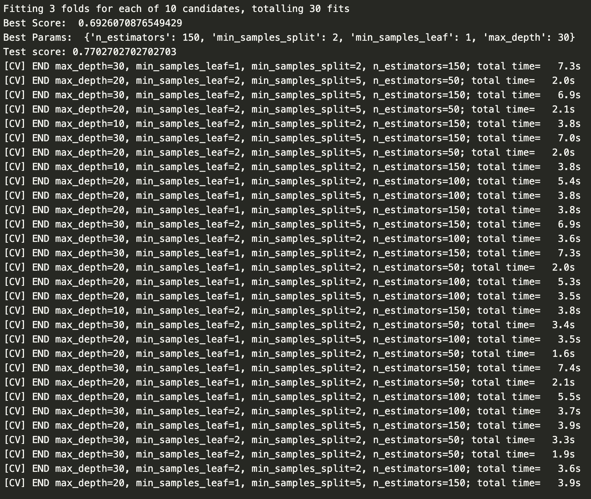

# Medical X-ray Image Classification


Author: Ashkan Nikfarjam

Collaborator: Vinhem Doung

# Abstract
Strong bones are the foundation of a healthy body. They protect organs and help muscles move. Therefore, it is crucial to maintain healthy bones. 

# Introduction
To assist practitioners with correct diagnosis, we aimed to use a CNN-RNN model to classify location of provided x-ray picture and whether it shows a fractured bone or a healthy one.  Qiwei Yin and et al, suggest that the CNN (Convolutional Neural Network) component processes images by filtering out non-essential information and retaining critical features, such as edges and shapes. The RNN (Recurrent Neural Network) component, specifically using bidirectional RNN structures like LSTM or GRU, then captures the dependencies and continuity in these features, enhancing the model's ability to analyze image sequences and improve classification accuracy.

# Data Sources

Our data is collected from Kaggle and Robofile. Our images consists of hands, forearms, knee, elbow, humerus, wrist, shoulders, legs, feet, hip, finger and vertebrae in the neck and back. 

For chest x-ray we only found data for classification of respiratory diseases. So we thought the damages done due to bone fracture in this area are so severe and instantly impactful that might need immediate medical attention. Thus we did not collect any data for this area. Also we were unable to find a concrete data for skull bones.

Figure1: After some cleaning this figure shows the all the data that  has been collected and how the are structured.


# Data Preprocessing

With the help of the graph we made with Lucidchart we noticed that majority of our data is only split into train and test. Some datasets do not have a validation set. Therefore, in order to resolve this issue, we decide to create a validation dataset by using 20% of our training data. 

We had also calculate the number of the existing data we had and combine data accordingly. For examole we found a data set in FracAtlas consisted of x-ray picture of hand, hip, shoulder and legs. The data was raw and was organized by a csv index file into fractured and nonfractured for each part. 
We wrote an script to see the number of extracted data to plan accordingly and here is what we found. 
```
        Total Fractured Hand X-Rays: 379
        Total Non Fractured Hand X-Rays: 902
        
        Total Fractured Hip X-Rays: 10
        Total Non Fractured Hip X-Rays: 169
        
        Total Fractured Shoulder X-Rays: 10
        Total Non Fractured Shoulder X-Rays: 91
        
        Total Fractured Leg X-Rays: 212
        Total Non Fractured Leg X-Rays: 1912
        

        # Hand & Other (Not Labeled Fractured or Non Fractured)
        
        Train Hand Files: 13140
        Train Other Files: 20224
        
        Test Hand Files: 1645
        Test Other Files: 2531
        
        Valid Hand Files: 1647
        Valid Other Files: 2530
        
        # Hand Part 2
       
        Train Frac Files: 711
        Train NonFrac Files: 596
       
        Test Frac Files: 225
        Test NonFrac Files: 256
       
        Valid Frac Files: 177
        Valid NonFrac Files: 148
        
        # Hands & Forearms
        
        Train Frac Files: 4391
        Train NonFrac Files: 4296
       
        Test Frac Files: 360
        Test NonFrac Files: 240
       
        Valid Frac Files: 89
        Valid NonFrac Files: 87
        
        # Legs
        
        Train Frac Files: 294
        Train NonFrac Files: 297
       
        Test Frac Files: 15
        Test NonFrac Files: 13
       
        Valid Frac Files: 28
        Valid NonFrac Files: 29
        
        # Legs&Feet
        
        Train Frac Files: 98
        Train NonFrac Files: 390
       
        Test Frac Files: 23
        Test NonFrac Files: 98
       
        Valid Frac Files: 7
        Valid NonFrac Files: 3
        
        # Shoulders
        
        Train Frac Files: 448
        Train NonFrac Files: 615
        
        Test Frac Files: 188
        Test NonFrac Files: 215
       
        Valid Frac Files: 112
        Valid NonFrac Files: 153

```

This analysis showed us that we do not have enough data to split into train, test and validation data. Comparing them to existing individual data sets we have, we decided to combine this data set with each individual datasets. We then added those contents into other folders and reorganized them into an even distribution of 60%, 20%, 20% respectively for Train, Test, Val datasets. In those files, we also have readme docs that showcase how many files there are, how it's organized and where it's derived from. 

### Ambiguous Datasets

A big challenge we face was ambiguous datasets. Sometimes, wrist x-ray resemble a hand x-ray. We thought there is a possibility that wrist pictures gets mistakenly identified as hand. To double check, we have a data set for classifying whether the picture is a hand x-ray or not. We are going to create a base model to check that. If all the pictures gets classified as hand we might just combine them with hand and represent them as one class. 

Just as hand and wrist dataset is ambiguous, we also noticed that legs and feet are ambiguous as well. Some pictures might be identified as feet and vice versa. Therefore, we must have a dataset for classifying whether the picture is a leg x-ray or not. We are going to use a second base model to check it. If all pictures are classified as legs, then we can just combine them into one class. 

The worst case scenario for two ambiguous datasets, is to simply combine the two.

### Wrist Data Set and how we need the hand base model.

The wrist data set was an example of an ambiguous dataset. Often, the images contained either hand, forearm or both. This made it harder for us to distinguish which one is which, and whether or not we should treat it as a seperate bone. Therefore, we decided to run the hand base model against it. 

### Image Truncation

We were running into a lot of truncated image errors during labeling some of our data using the base model we made for this task. We created a script that could verify truncation and repair truncated images by repairing the truncated part to black. After redownloading the data we ran the script and this is the result. Apparently truncation happened due to errors in compressing and transferring data. 


```
eTrkImg.py 
Repairing legs and feet truncated images: 100%|█| 619/619 [00:00<00:00, 10523.
                                           file_path  truncated  repaired
0  newData/legsANDfeet/train/188_jpg.rf.7b0af0c70...      False     False
1  newData/legsANDfeet/train/119_jpg.rf.71666f3e0...      False     False
2  newData/legsANDfeet/train/95_jpg.rf.28ebcce69f...      False     False
3  newData/legsANDfeet/train/04_jpg.rf.7d15a19e51...      False     False
4  newData/legsANDfeet/train/130_jpg.rf.dbfd136d3...      False     False
truncated
False    619
Name: count, dtype: int64
repaired
False    619
Name: count, dtype: int64
CSV Data created for Legs & Feet
          None
          Number of Truncated Data: None
          Number of Repaired Data: None
          
Repairing hands and fingers truncated images: 100%|█| 9920/9920 [00:00<00:00, 
                                           file_path  truncated  repaired
0  newData/handsNfingers/train/2db5900558d0a70f24...      False     False
1  newData/handsNfingers/train/a952bdf7d90d82ce7a...      False     False
2  newData/handsNfingers/train/Screenshot-2022-07...      False     False
3  newData/handsNfingers/train/image-17-_jpeg_jpg...      False     False
4  newData/handsNfingers/train/390839a10f1484837c...      False     False
truncated
False    9920
Name: count, dtype: int64
repaired
False    9920
Name: count, dtype: int64
CSV Data created for Hands & Fingers
          None,
          
          Number of Truncated Images: None
          Number of Repaired Images: None
          
Repairing hands and forearms truncated images: 0it [00:00, ?it/s]
Empty DataFrame
Columns: [file_path, truncated, repaired]
Index: []
Series([], Name: count, dtype: int64)
Series([], Name: count, dtype: int64)
CSV Data created for Neck and Spine
          None,
          
          Number of Truncated Images: None
          Number of Repaired Images: None
          
Reparing neck and spine truncated images: 100%|█| 1001/1001 [00:00<00:00, 1089
                                           file_path  truncated  repaired
0  newData/NeckSpine/train/fracture/47f7292e24689...      False     False
1  newData/NeckSpine/train/fracture/ac5e26296afa0...      False     False
2  newData/NeckSpine/train/fracture/8523b6e75393d...      False     False
3  newData/NeckSpine/train/fracture/a52cefa39878f...      False     False
4  newData/NeckSpine/train/fracture/cf1a195d74090...      False     False
truncated
False    1001
Name: count, dtype: int64
repaired
False    1001
Name: count, dtype: int64
CSV Data created for Neck and Spine
          None,
          
          Number of Truncated Images: None
          Number of Repaired Images: None
          
```

One partner preprocessed and organized that data. After doing so, he transferred them into a usb drive. Sometimes, the transfers do not work and can get corrupted. Usually, for truncated images we either get nearly all of images are truncated or very few images are truncated.

### Steps of making base model for hand classification
* Data Augmentation: Utilizing Keras image generator and applying rescale for normalization of pixel values and apply rotations and applying Fourier transformations for more accurate classification. And resize inside the img_fft function:

``` Python
data_gen = ImageDataGenerator(
        rescale=1.0 / 255,  # Normalize pixel values
        rotation_range=90,  # Augmentation
        preprocessing_function=img_fft  # Apply our custom FFT preprocessing
    )
```

Our research proposes to use Fourier Transformation on these images.  Fourier Transformation is an algorithm where it allows us to transform images into a matrix of frequencies. Low frequencies represent gradual variations in the image; that contain the most information because they determine the overall shape or pattern in the image. High frequencies correspond to abrupt variations in the image; they provide more detail in the image, but they contain more noise (NV5). Since traditional Fourier Transform methods struggle with sudden or non-stationary signals, the authors suggest using a wavelet transform within the Fourier domain. This approach captures both local and global image characteristics, allowing the CNN-RNN model to extract valuable features from both the frequency and time domains of the image data (Qiwei Yin and et al). 

And this is the section we apply transformation:

``` Python
# Preprocessing function for Fourier Transform
    def img_fft(image):
        # Resize to target dimensions
        image = tf.image.resize(image, (128, 128))

        # Apply FFT
        fft_image = tf.signal.fft2d(tf.cast(image, tf.complex64))  # FFT returns complex numbers
        fft_image = tf.abs(fft_image)  # Use the magnitude

        # Normalize the FFT output
        fft_image = tf.math.log(1 + fft_image)  # Log scaling for visualization

        # Ensure we have 3 channels
        if len(fft_image.shape) < 3 or fft_image.shape[-1] != 3:
            fft_image = tf.stack([fft_image] * 3, axis=-1)

        return fft_image
```

The reduction in the size was necessary, otherwise the Fourier Transformation makes the process computationally expensive. We were getting running out of resources error.

* Create Test/Train/Validation dataset: ImageDataGenerator's folow_fron_directory() method, creates numpy array of our data, containing the frequency information, and its relative label.  

```Python
# Ensure `target_size` matches your FFT resizing (128x128)
    train_data = data_gen.flow_from_directory(
        './Data/Data/Hand/train',
        target_size=(128, 128),  # Matches resizing in `img_fft`
        color_mode='rgb',       # Ensures 3 channels are expected
        class_mode='binary',
        batch_size=batch_size
    )
    validation_data = data_gen.flow_from_directory(
        './Data/Data/Hand/val',
        target_size=(128, 128),
        color_mode='rgb',
        class_mode='binary',
        batch_size=batch_size
    )
    test_data = data_gen.flow_from_directory(
        './Data/Data/Hand/test',
        target_size=(128, 128),
        color_mode='rgb',
        class_mode='binary',
        batch_size=batch_size
    )

```


# Model Selection

Research shows strong performance of CNN-RNN model. However the complexity of these models arises during hyper parameter tuning. It is essential to use an appropriate architecture of neural network. In our case would be appropriate number of convolution, max pooling layers for CNN, and appropriate number of LSTM and number of layers in RNN. To come up with an optimal network structure NAS is utilized to help us to find optimal network architecture with optimal parameters.

# Network Architecture Search

NAS is a subfield of automated machine learning that automates all steps in the machine learning pipeline, from data cleaning, to feature engineering and selection, to hyperparameter optimization and architecture search. 


To mitigate hyperparameter optimization (HPO) problems, NAS uses a search space, a search strategy and a performance estimation strategy to peak the best model architecture.

A search space is a set of all architectures that NAS can select. A search strategy is a technique that is used to find the optimal strategy in the search space. A performance estimation strategy is a strategy where we try to predict the performance of the neural architecture.

NAS also trains the model, but with a unique twist: while a typical training process only adjusts the weights of a fixed network architecture, NAS actively trains both the model weights and the network architecture itself, searching for the optimal structure within a defined search space to achieve the best performance on a given task. 
**Mathematically**


## Result of Base Model for Hand

The Nas search for out hand base model, trained a CNN-RNN model that has test accuracy of 76.18% and loss of 48.7%.


And these is the architecture of the hand base model


### Labeling Hands and Forearm Images

Since we forgot to explicitly declare the model class indecies, I wrote this script to retuns class lables definition.
```Python
from tensorflow.keras.preprocessing.image import ImageDataGenerator

# Define the same data generator as in the main script
data_gen = ImageDataGenerator(
    rescale=1.0 / 255,
    rotation_range=90,
    preprocessing_function=None  # No preprocessing needed for this task
)

# Path to the training directory
train_data_path = './Data/Data/Hand/train'

# Load the data and map the labels
train_data = data_gen.flow_from_directory(
    train_data_path,
    target_size=(128, 128),
    color_mode='rgb',
    class_mode='binary',
    batch_size=32,
    shuffle=False  # Disable shuffle to match labels with directory names
)

# Extract the class indices
class_indices = train_data.class_indices

# Reverse the dictionary to map 0 and 1 to class names
label_mapping = {v: k for k, v in class_indices.items()}

print("Label Definitions:")
for label, class_name in label_mapping.items():
    print(f"{label}: {class_name}")

```
```
Label Definitions:
0: hand
1: other

```

After running hand base model on the hand and forearm data, it seems like they are all predicted to be hands! This means we are going to label all the pictures in this folder as hands and combine it with the existing hands. 

```
$ python hand_FA_labels\ _summer.py 
 
       HF Frac Test Predicted Label: predicted_label
0    360
Name: count, dtype: int64
       

      HF Frac Train Predicted Label: predicted_label
0    4391
Name: count, dtype: int64
       

      HF Frac Valid Predicted Label: predicted_label
0    89
Name: count, dtype: int64
      
 
       HF NFrac Test Predicted Label: predicted_label
0    240
Name: count, dtype: int64
       

      HF NFrac Train Predicted Label: predicted_label
0    4296
Name: count, dtype: int64
       

      HF NFrac Valid Predicted Label: predicted_label
0    240
Name: count, dtype: int64
      

```

We also run our hand base model on wrists. They all got classified as hands!

This means our hand dataset shall be a mix of hands, wrist and forearms or vice versa.

We created another another one for labling legs, and another one for classifying fractured non-fracture/

# Main Model
Yin's paper, proposes CNN, and a Bidirectional LSTM RNN model. 
### Convolutional Layers
* Convolutional layers exatract important features from the raw data. Since we are deploying wavelet tranformation it does a greate job in detecting edges and shapes. 

* By applying multiple level of filtering, and max pooling layers, progressively combine lower-level features (edges, textures) into higher-level representations (objects, concepts). As well as dimentionality reduction.

### Why Wavelet Transfor
* Wavelet Transform provides both time and frequency information, making it ideal for analyzing signals or images where localized features (e.g., edges or patterns) are important.
* It is better suited for non-stationary signals (signals whose frequency characteristics change over time or space), such as fractured bones in medical imaging

### RNN
* Standard RNNs process data sequentially in one direction (e.g., from start to end). While useful, this approach limits the ability to understand dependencies that occur later in the sequence.

* Bidirectional RNNs add a second layer that processes the sequence in the opposite direction, enabling the model to use both previous and future context at every point in the sequence.


1. Forward pass:

   $$
   S_{i,j}^F = f_{\text{FWD}}(S_{i-1,j}^F, x_{i,j}), \quad \text{for } i = 1, \ldots, N
   $$

2. Backward pass:

   

## Stages of setting NAS for our Base Model
 
## Preprocessing:
* Apply wavelet Transform
* Normalyze Amplitude Matricies
* Check and repaire truncated data

# Search Space
* added convolution 2D layer
* added biodirectional RNN with LSTM component
* added a softmax layer at the end

# Nas parameter
* loss='sparse_categorical_crossentropy': is a commonly used loss function in machine learning, particularly for multi-class classification problems where target labels are integers rather than one-hot encoded.

# Search Strategy 
* Validation Score


Our Main Model Nas Trained a model with accuracy %88.5. With the following structure:





# performance of main model


# Main Model
[Click to watch on YouTube](https://youtu.be/7yxMjqB8peY)

This graph indicates our model metricies. We can see that oevar our model did pretty good on the class classification, except for knee and spine category.


# Comparing Performance of out Main model with 2 other models

### CNN with NAS and hyperparameter tuning Result


We also developed a CNN with hyperparameter testing and NAS. This was done to improve our CNN model and get better results. This CNN, like the previous one, was a binary classifier to determine which bone is fractured or not. It consisted of similar lines as the traditional CNN with hyperparameter tuning. However, to be clear this new CNN model ran on data that was just a random 10% sample of our original data. We noticed that it received a much better test accuracy of 87% percent. This was a much a better improvement than our previous 51%.

After seeing the result we knew that running a NAS model would be far better for our main model than a traditional program. 

### CNN


We developed a traditional CNN to compare it's performance with our main model. The traditional CNN is a basic neural network that is built to compare the main model. The CNN consists of Conv2D, BatchNormalization, Flatten, Dropout, MaxPooling and Dense layers. The Dense layer at the end has a value of 1 and an activation function of sigmoid. Thereby, showcasing that it's a CNN for binary classification.

Unfortunately, we ran our CNN on a large and diverse dataset and it only recieved an accuracy of 51.73 percent. Therefore, the CNN was an inferior model and it motivated us to find a better model to surpass it.


### Random Forest Hyperparameter Testing Result


We ran a RandomSearchCV with a random forest classifier as our model. Our data was 10% of the main data we had, as our main data was too large for the RandomSearchCV. We chose random forest classifier as it pairs well with RandomSearchCV. Random Forest can handle diverse data. Random Forest is also less susceptible to overfitting. Therefore, it seemed like a perfect fit for our large and diverse data. 

Before, we run our model, we had to process the data. We had to keep track of the labels, which ones were fractured and nonfractured. We also had to transform our images into integer arrays and resize them. After that, we split the data into 80% training and 20% test. We also created a validation set based around the 20% of the training set. 

After that, we decided to input our values and set our parameters. RandomForestClassifier was chosen for the reasons mentioned aboved. We also decided to choose RandomSearchCV as it was quicker than hyperparameter testing apps. Despite the fact, that our dataset was only 10% of the original dataset. We still had to lower our parameters into the basic level. For example, the number of iterations we had to make was 10 and the number of folds for cross-validation was 3. 

After, running the model we were suprised by how accurate it was. It granted us a best score of 69% whilst, it granted us a test score of 77%, in contrast to the previous basic random forest classifier we had it was only around 64%.

Therefore, we can ascertain that the Random Forest randomSearchCV model is efficient and possibly better than the CNN. However, it is not as good as our main model.


# Performance comparison


Using plotly we graph these models perforamance to compare them to each other. It is evident that CNN model that we train with keras tuner is almost good as our model on acuracy. But musch more worst in loss scor. Thanks to the RNN component that made the prediction more accurate. 


# Check for GPUs
```python
gpus = tf.config.list_physical_devices('GPU')
if gpus:
    try:
        for gpu in gpus:
            tf.config.experimental.set_memory_growth(gpu, True)
        print(f"GPUs found: {gpus}")
    except RuntimeError as e:
        print(e)
else:
    print("No GPU detected")
```

